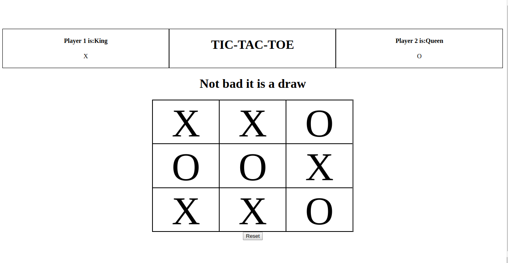

# javascript-tic-tac-toe

This is a tic-tac-toe web project built by [pwilson77](https://github.com/pwilson77) and [Raphael Noriode](https://github.com/Oghenebrume50).

The game utilizes ES6 functions such as Factories and Modules to avoid using classes.

### Technologies used

**_HTML,CSS & JS _**

### To view the project online

1. Follow this [link](https://pwilson77.github.io/javascript-tic-tac-toe/dist/index.html)

### steps to play
- Visit the link above
- Enter names of players
- Play the game

May the best man win :wink:
